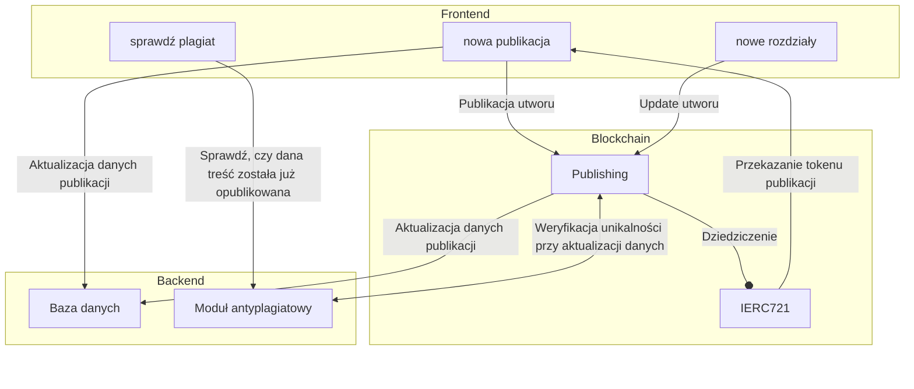
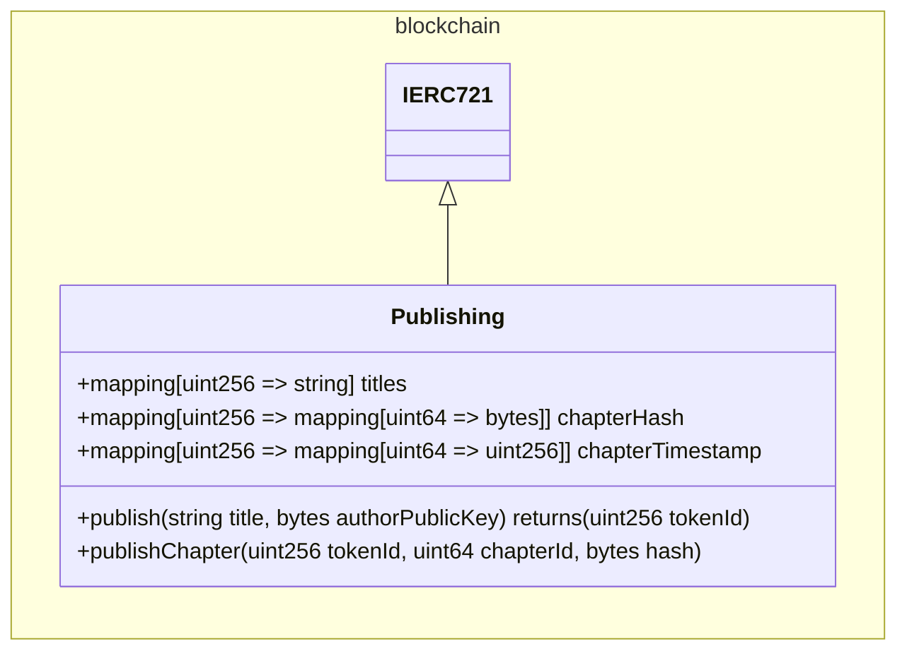
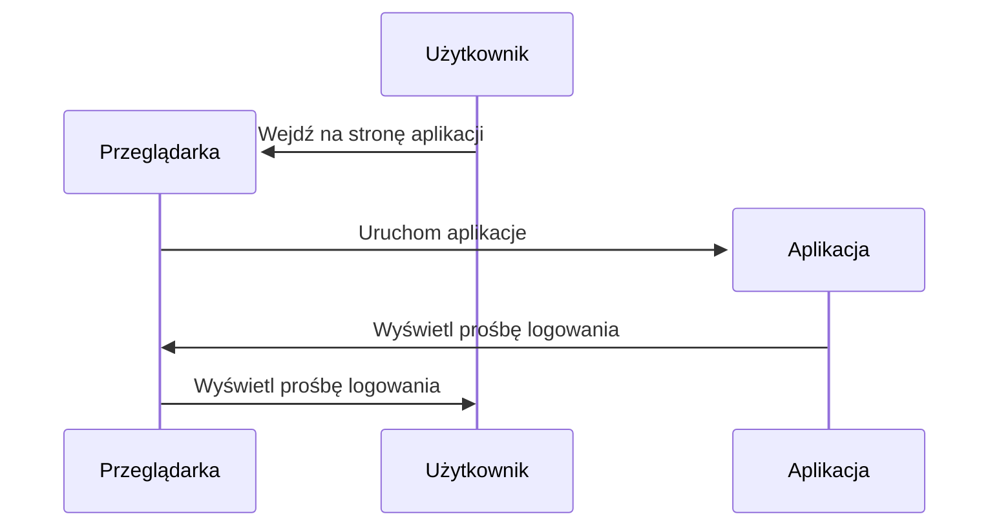
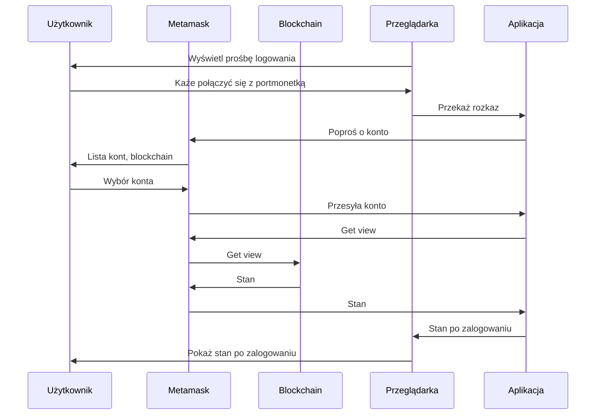
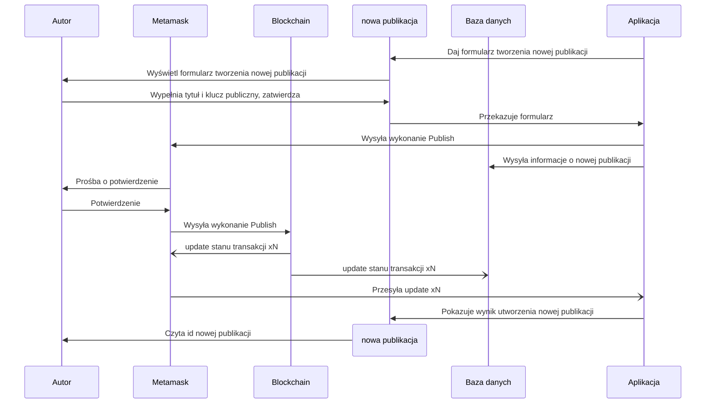
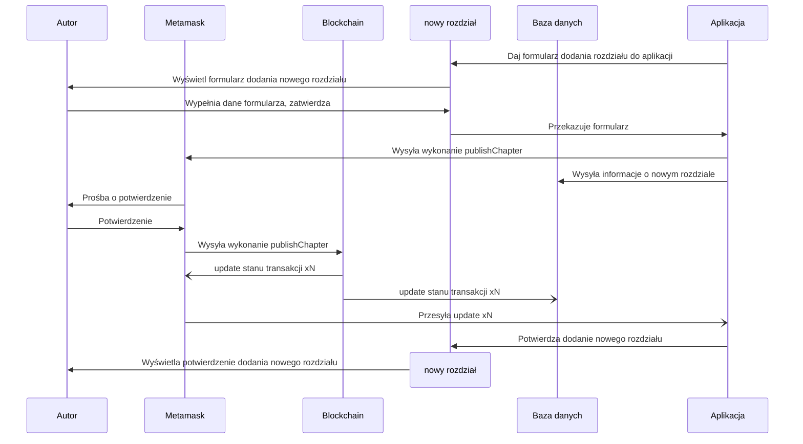
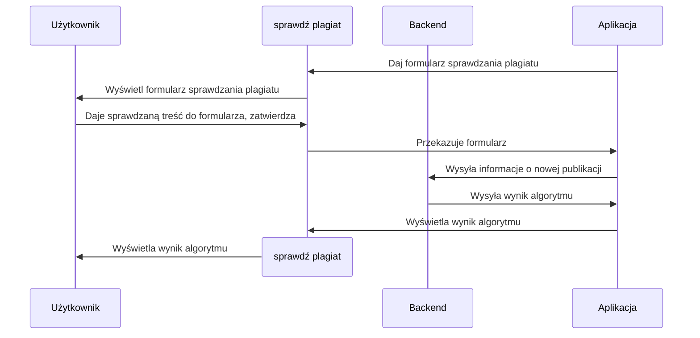

# Kontrola praw autorskich na blockchainie

### Kacper Harasimowicz kh429221

### 21.05.2025

### Programowanie z blockchainem

# Wstęp

'Kontrola praw autorskich na blockchainie' to projekt, który utrzymuje własność wydawanych treści oraz pozwala na sprawdzanie, czy publikacja nie jest plagiatem istniejących już treści.

Dokładniej mówiąc, projekt składa się z 2 części: notowanie publikacji i systemu antyplagiatowego.
Notowanie publikacji utrzymuje dane autora i daty publikacji, aby w razie konfliktu skopiowanych treści można było poprawnie ustalić właściciela treści
System antyplagiatowy pozwala ustalać, czy nowo publikowane treści są kopią wcześniej istniejących już publikacji

# Moduły

- **nowa publikacja**
  Strona frontendu, w której autor publikuje nową publikację. Strona oczekuje tytułu oraz klucza publicznego autora. Dane są wysłane do bazy danych i wywołana jest funkcja `publish` w smart kontrakcie.
- **nowe rozdziały**
  Strona frontendu, w której autor dodaje nowe rozdziały do posiadanej publikacji i modyfikuje dodane już rozdziały. Strona oczekuje treści nowego rozdziału i tokenu publikacji, do której ten rozdział ma trafić. Wysyła ona treść do bazy danych i wywołuje odpowiednią funkcję `publishChapter` smart kontrakcie.
- **sprawdź plagiat**
  Strona frontendu pozwalająca osobom zainteresowanym sprawdzenie, czy podana treść została już wcześniej opublikowana. Wysyła treść do sprawdzenia do backendu, który zwraca czy podana treść jest już w bazie danych.
- **Baza danych**
  Baza danych utrzymująca treści opublikowanych rozdziałów. Utrzymuje pełne treści rozdziałów, których magazynowanie na blockchainie jest niepotrzebne. Jest potrzebnym elementem modułu antyplagiatowego.
- **Moduł antyplagiatowy**
  Usługa porównująca podaną treść z bazą danych. Podaje, czy treść została już opublikowana. 
  Wykonuje zapytania frontendu aplikacji 'sprawdź plagiat'.
- **Publishing**
  Smart contract który generuje tokeny odpowiadające reprezentujące własność publikacji. Dokładny opis poniżej.

## Dokładniejszy opis kontraktu

kontrakt publishing udostępnia publicznie 5 zmiennych i 2 funkcje:
### Zmienne
| Nazwa    | format | limity | opis   | 
|---------|--------|------|--------|
| `titles` | `map[tokenId -> title]` | N/A | Lista tytułów publikacji w zależności od id tokenów. |
| `chapterHash` | `map[tokenId -> map[chapterId -> hash]]` | chapterId < $10^{18}$ | Hashe treści rozdziałów w zależności od id tokenów i numerów rozdziałów. Numery rozdziałów wybrane przez autora. |
| `chapterTimestamp` | `map[tokenId -> map[chapterId -> timestamp]]` | chapterId < $10^{18}$ | Daty publikacji rozdziałów w zależności od id tokenów i numerów rozdziałów. Podane w formie timestampu unixa (sekund od 1 stycznia 1970). Numery rozdziałów wybrane przez autora. |
### Funkcje
- **publish**
  Wywoływana przez autora, generuje i zawraca token nowej publikacji. Przyjmuje tytuł nowej publikacji. Generuje nowy token, zwraca go autorowi i aktualizuje [titles] dla nowo wygenerowanego tokenu podanymi danymi.
- **publishChapter**
  Wywoływana przez autora, dodaje nowy rozdział do istniejącej publikacji. Przyjmuje token powiązany z aktualizowaną publikacją, numer dodawanego rozdziału (jak wyżej) oraz hash zawartości dodawanego rozdziału (w formie stringa).

# Interakcje

## Inicjacja

Użytkownik przed użyciem jakiejkolwiek funkcjonalności aplikacji musi wejść na odpowiednią stronę i zacząć się logować.

## Logowanie

Użytkownik przed użyciem jakiekolwiek funkcjonalności musi się zalogować. Klika on więc guzik logowania i otrzymuje od metamaska prośbę o zalogowanie i połączenie konta z aplikacją. Po zalogowaniu użytkownik otrzymuje informację zwrotną, że jest już zalogowany, oraz opcje zależne od frontendu, na który on wszedł.

## Nowa publikacja

Autor chce opublikować nową publikację. Najpierw się loguje, a następnie musi podać tytuł nowo publikowanej pracy. Po podaniu, zatwierdzeniu danych i potwierdzeniu operacji w metamasku musi zaczekać na blockchain, aż otrzyma potwierdzenie zarejestrowania nowej publikacji oraz powiązany z nią token.

## Nowy rozdział

Autor chce opublikować nowy rozdział do pisanej przez niego publikacji. Musi się on zalogować, a następnie podać aplikacji tokenId publikacji, do której chce dodać rozdział i treść samego rozdziału. Po zatwierdzeniu danych i potwierdzeniu operacji w metamasku może zamknąć stronę wcześniej lub zaczekać na potwierdzenie z blockchaina, że rozdział został dodany.

## Sprawdź plagiat

Użytkownik chce sprawdzić, czy posiadana przez niego treść publikacji już została przez kogoś wydana, i przez kogo. Po zalogowaniu podaje on więc treść do sprawdzenia, a następnie czeka na odpowiedź z backendu. Otrzymuje on odpowiedź, albo że takiej treści nie ma, albo jaka publikacja pasuje do podanej treści.

# Szacowania

### Testy jednostkowe

#### Kontrakt `Publishing`
- publish() – test poprawnego wywołania: **1h**
- publishChapter():
  - nowy chapterId: **1h**
  - istniejący chapterId: **1h**
  - tokenId spoza własności autora: **1.5h**

**Łącznie kontrakt: 4.5h**

#### Frontend
- logowanie do Metamaska: **1h**
- formularz nowej publikacji: **1.5h**
- formularz nowego rozdziału: **1.5h**
- publikacja istniejącego rozdziału: **1h**
- błędny tokenId: **1h**
- formularz sprawdzania plagiatu: **1h**

**Łącznie frontend: 7h**

#### Backend
- testy antyplagiatowe:
  - przypadek: plagiat: **1.5h**
  - przypadek: brak plagiatu: **1.5h**

**Łącznie backend: 3h**

**Suma testów jednostkowych: 4.5 + 7 + 3 = 14.5h**

---

### Testy integracyjne

- Utworzenie nowej publikacji i pierwszego rozdziału: **2h**
- Publikacja kilku rozdziałów na raz: **2h**
- Publikacja tego samego rozdziału dwukrotnie: **1.5h**
- Publikacja tej samej treści przez dwóch autorów: **2.5h**
- Sprawdzenie, czy nowa publikacja wykrywana jest jako plagiat: **2h**
- Sprawdzenie, czy inna publikacja wykrywana jest jako plagiat względem już opublikowanej: **2h**

**Suma testów integracyjnych: 12h**

---

### Szacowanie czasowe

| Komponent / Kontrakt      | Operacja                         | Czas [h] |
|---------------------------|----------------------------------|----------|
| **Kontrakt: Publishing**  | Create: `constructor`            | 2h       |
|                           | Create: `publishChapter()`       | 3h       |
|                           | Create: `publishChapter()`       | 4h       |
|                           | Read: odczyt map (tytuł, podpis) | 1h       |
|                           | Delete: brak                     | 0h       |
| **Frontend**              | UI: nowa publikacja              | 2h       |
|                           | UI: nowe rozdziały               | 2h       |
|                           | UI: sprawdzenie plagiatu         | 2h       |
| **Backend**               | API do komunikacji z blockchain  | 4h       |
|                           | Zapis metadanych do bazy         | 2h       |
|                           | Obsługa antyplagiatu             | 4h       |
| **Antyplagiat**           | Analiza podobieństw              | 5h       |

**Suma czasu: 31h**

---

### Podsumowanie

- Szacowany czas wykonania funkcjonalności (CRUD): **33h**
- Szacowany czas testów jednostkowych: **14.5h**
- Szacowany czas testów integracyjnych: **12h**

**Łącznie: 31h + 14.5h + 12h = 57.5h**